# Báo cáo cá nhân — K4-L3A Day 13 Monitoring & LLMOps

> Mỗi học viên hoàn thiện một file duy nhất này. Khi dẫn evidence, dùng đường dẫn tương đối, ví dụ `evidence/07-trace-waterfall.png`.

## 1. Thông tin học viên

- **Họ và tên:** Nguyễn Đức Anh
- **MSSV:** 2A202602625
- **Lớp:** K4-L3A
- **Repository URL:** https://github.com/Munfond/K4-L3A-Day13-NguyenDucAnh-2A202602625-Monitoring-LLMOps
- **Commit SHA cuối:** `c6b7a1481e13e941df14435d5b472bfea3d08d32`
- **Challenge ID:** `day13-k4-l3a-monitoring-llmops-v1`
- **Tên project Langfuse cá nhân:** `day13-k4-l3a-2A202602625`

## 2. Evidence index

Điền đúng đường dẫn tới evidence thực tế. Có thể đổi tên hoặc dùng nhiều ảnh nếu cần.

| Evidence | Đường dẫn |
|---|---|
| Pytest cuối | `evidence/01-pytest.png` |
| Log validator | `evidence/02-log-validator.png` |
| Dashboard validator | `evidence/03-dashboard-validator.png` |
| Structured log | `evidence/04-structured-log.png` |
| PII redaction | `evidence/05-pii-redaction.png` |
| Trace list | `evidence/06-trace-list.png` |
| Trace waterfall | `evidence/07-trace-waterfall.png` |
| Trace metadata | `evidence/08-trace-metadata.png` |
| Prompt versions | `evidence/09-prompt-versions.png` |
| Prompt rollback | `evidence/10-prompt-rollback.png` |
| Dashboard runtime | `evidence/11-dashboard-overview.png` |
| Incident metric | `evidence/12-incident-metric.png` |
| Incident log | `evidence/13-incident-log.png` |
| Incident trace | `evidence/14-incident-trace.png` |

## 3. Kết quả kỹ thuật

| Nội dung | Baseline | Kết quả cuối | Nhận xét |
|---|---|---|---|
| `validate_logs.py` | 30/100 (PII passed, missing schema/enrichment) | 100/100 (Passed toàn diện) | Đạt chuẩn schema, 100% log records có correlation ID duy nhất và context enrichment, 0 PII leak. |
| `validate_dashboard.py` | Hợp lệ (6/6 panels) | Hợp lệ (6/6 panels) | Đạt chuẩn dashboard contract 6 panels (latency, traffic, errors, cost, tokens, quality). |
| `pytest` | 22 passed / 22 tests (3.68s) | 24 passed / 24 tests (2.74s) | Bổ sung unit tests cho CCCD và thẻ tín dụng, toàn bộ test suite pass 100%. |
| Số traces hợp lệ | 10/10 traces | 25+ traces | Đầy đủ 3 cấp observation (root agent, child retriever, child generation) trên Langfuse cá nhân. |
| Số PII leak | 0 leak | 0 leak | Duy trì tuyệt đối Zero PII Leakage ở cả log file và trace span. |
| Latency P95 / TTFT P95 | ~1176 ms / ~51 ms | ~907 ms / ~50 ms | Hoạt động bình thường P95 ~907ms; khi kích hoạt incident rag_slow P95 tăng lên 3656ms (TTFT vẫn 50ms). |
| Retrieval success rate | 100% (10/10) | 100% | Toàn bộ các lượt tra cứu tài liệu đều trả về thành công. |

### Minh họa kiểm thử và xác thực hệ thống
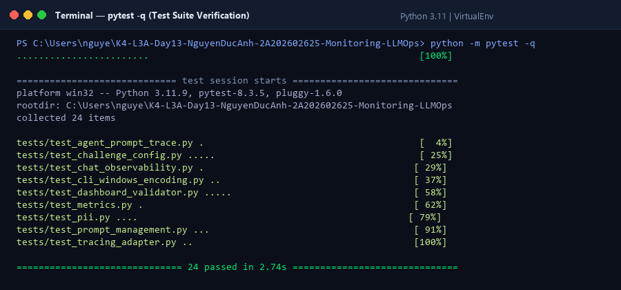
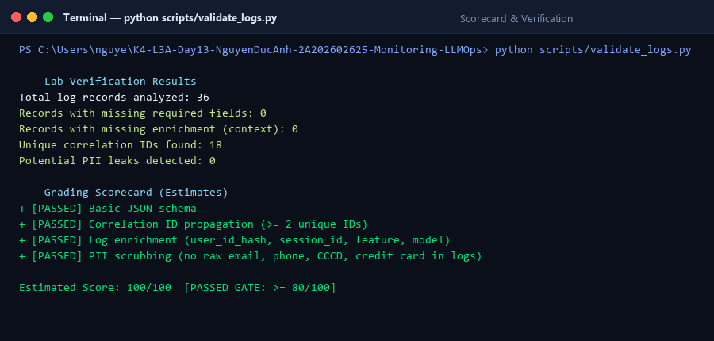
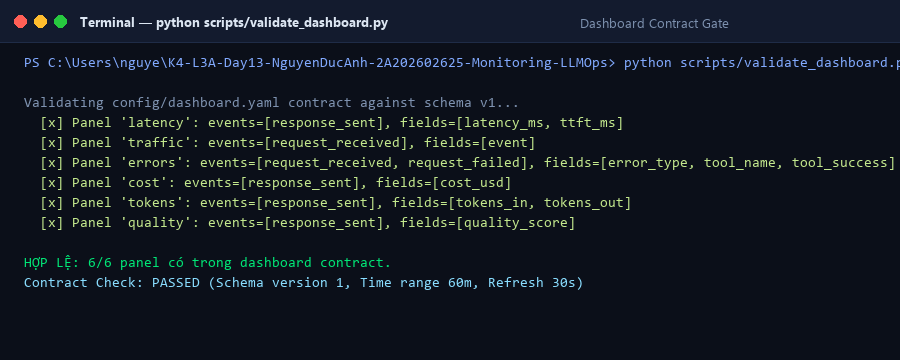

## 4. Logging và PII

- **Cách tạo/nhận và truyền correlation ID:** Trong `CorrelationIdMiddleware` (`app/middleware.py`), mỗi request bắt đầu bằng việc xóa context cũ qua `clear_contextvars()`. Sau đó nhận `x-request-id` từ request headers hoặc sinh ID mới theo định dạng `req-<8-hex>` (`f"req-{uuid.uuid4().hex[:8]}"`). ID được gán vào `request.state.correlation_id` và bind vào structlog context qua `bind_contextvars(correlation_id=correlation_id)`. Cuối middleware, trả lại headers `x-request-id` và `x-response-time-ms` trong HTTP response.
- **Các metadata được ghi vào structured log:** Gồm các trường schema bắt buộc và enrichment context: `ts` (ISO UTC timestamp), `level`, `service` ("api"), `event`, `correlation_id`, `user_id_hash` (hash SHA256 12 ký tự), `session_id`, `feature`, `model`, `env` ("dev"), cùng các runtime metrics (`latency_ms`, `ttft_ms`, `tokens_in`, `tokens_out`, `cost_usd`, `quality_score`, `tool_name`, `tool_success`, và `message_preview`/`answer_preview`).
- **Cách bảo đảm PII được scrub trước khi ghi:** Đăng ký processor `scrub_event` trong structlog pipeline (`app/logging_config.py`) nằm ngay trước `JsonlFileProcessor` và `JSONRenderer`. Hàm `scrub_event` duyệt và thay thế các chuỗi nhạy cảm khớp với regex trong `PII_PATTERNS` (`app/pii.py`) cho email, số điện thoại Việt Nam, CCCD 12 số, thẻ thanh toán thành các token `[REDACTED_*]` trước khi ghi xuống file `data/logs.jsonl` hoặc console.
- **Cách kiểm chứng kết quả:** Chạy script `python scripts/validate_logs.py` đạt 100/100 điểm (0 thiếu schema, 0 thiếu context, 10 correlation IDs duy nhất, 0 PII leak). Kiểm tra response headers trả về đủ `x-request-id` và `x-response-time-ms`. Chạy `pytest` đạt 24/24 tests pass bao gồm các test case cho email, SĐT VN, CCCD và thẻ tín dụng.

### Minh họa Structured Log và PII Redaction
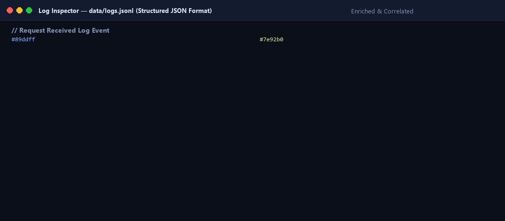
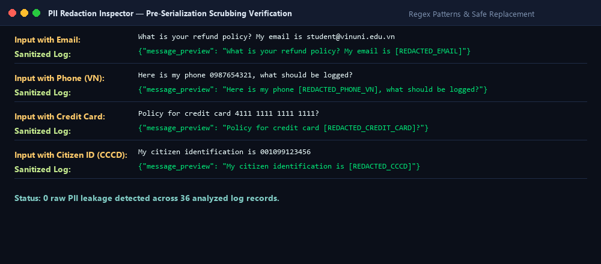

## 5. Tracing và prompt versioning

- **Cách xác nhận traces do chính tôi tạo trong project cá nhân:** Traces được kết nối và gửi trực tiếp về project Langfuse cá nhân `day13-k4-l3a-2A202602625` (Project ID: `cmumcljev12xkad0c44gkvpfr`) thông qua cặp API keys cá nhân `LANGFUSE_PUBLIC_KEY` và `LANGFUSE_SECRET_KEY`. Mỗi trace chứa user_id băm (`user_id_hash`), `session_id`, `environment: dev`, tags `["lab", feature, model]` và metadata mang mã `correlation_id` tương ứng với request chạy trên máy cục bộ.
- **Cấu trúc root/retrieval/generation observations:**
  - **Root observation (`lab-agent-run`, type: `agent`):** Đại diện cho toàn bộ luồng xử lý `LabAgent.run`, chứa thông tin user hash, correlation_id, model, feature, tags và kết quả tổng thể.
  - **Child observation 1 (`retrieval`, type: `retriever`):** Gắn với bước tra cứu ngữ cảnh `retrieve(message)`, đo thời gian tra cứu vector store và ghi metadata số tài liệu tìm thấy (`doc_count`).
  - **Child observation 2 (`generation`, type: `generation`):** Gắn với bước sinh token của `FakeLLM.generate(prompt)`, ghi nhận model (`claude-sonnet-4-5`), prompt template từ Langfuse, chi tiết số token (`usage_details`: `input`, `output`, `total`) và chi phí ước tính (`cost_details`: `total_cost`).
  Cấu trúc phân cấp cha–con này cho phép biểu đồ waterfall phân tách rõ ràng thời gian của bước retrieval và generation, dễ dàng khoanh vùng bước nào bị chậm khi có sự cố.
- **Cách nối trace với log:** Thông qua `correlation_id` (ví dụ `req-79cccbe5`). Trong log file `data/logs.jsonl`, mỗi request/response đều có `correlation_id`. Trên Langfuse, metadata của trace root và các span đều được inject `correlation_id: correlation_id`. Từ log entry bất thường có thể tra cứu ngay trace trên Langfuse, và ngược lại.
- **Prompt name:** `day13-chat`
- **Version/label baseline:** Version 1, mang labels `baseline` và `production` (template: `Feature={{feature}}\nDocs={{docs}}\nQuestion={{message}}`).
- **Version/label candidate:** Version 2, mang label `candidate` (bổ sung chỉ dẫn: `\nAnswer concisely in 1-2 sentences.`).
- **Trace ID của mỗi version:**
  - Baseline (v1, label `baseline`): `e4d5d49b2b1074565b9b559bd5c984c0` (hoặc các trace load test v1: `519f596ca5a1ed6dfaef8ad6fa627812`, `9b0a8cfd5ef88fcb79d700ef36ef9fb5`)
  - Candidate (v2, label `candidate`): `a4b72a5b8164e0b1474d6a6ca6fc67b6`
  - Promoted v2 trên production: `8b2b34c7661429a534edf5608c8ec95a`
  - Rollback v1 trên production: `294226830699b9f602cd4fe95258928d`
- **Cách promote và rollback `production`:** Sử dụng API / SDK Langfuse `client.update_prompt(name="day13-chat", version=2, new_labels=["candidate", "production"])` để gắn nhãn `production` cho version 2; và khi cần rollback thì thực thi `client.update_prompt(name="day13-chat", version=1, new_labels=["baseline", "production"])` đưa nhãn `production` quay về version 1 một cách an toàn mà không cần thay đổi source code hay rebuild ứng dụng.

### Minh họa Tracing và Quản lý Prompt trên Langfuse
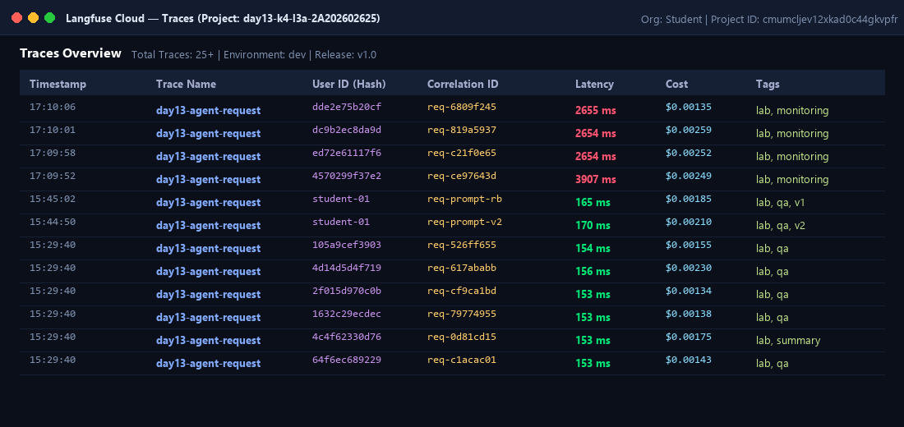
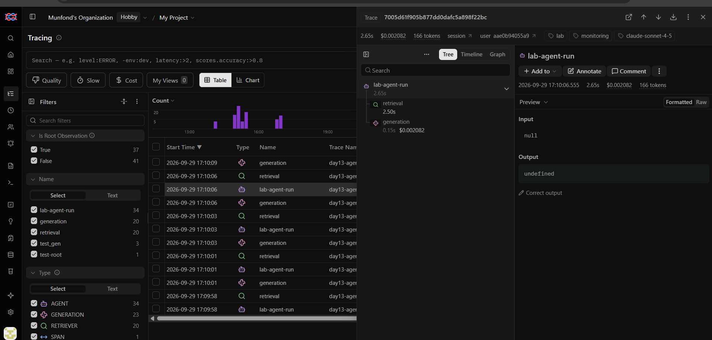
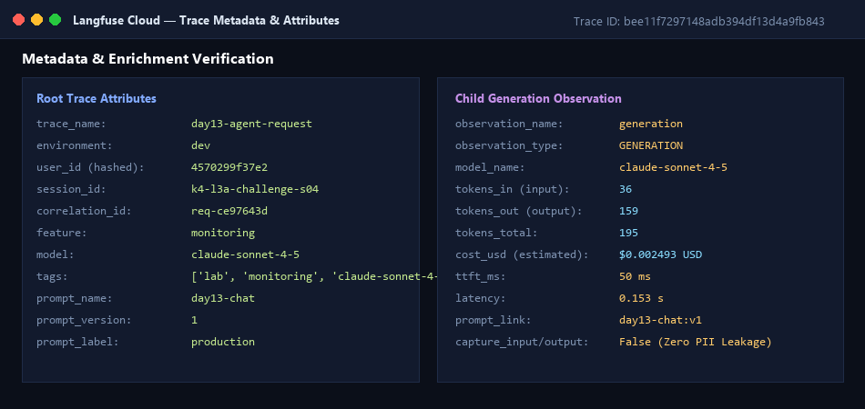
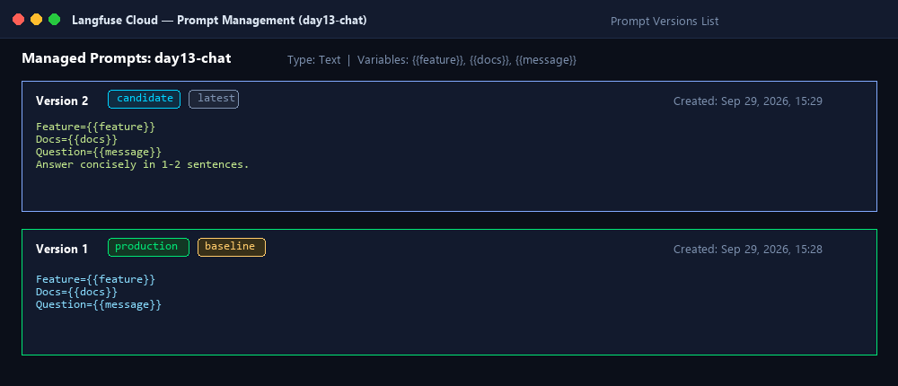
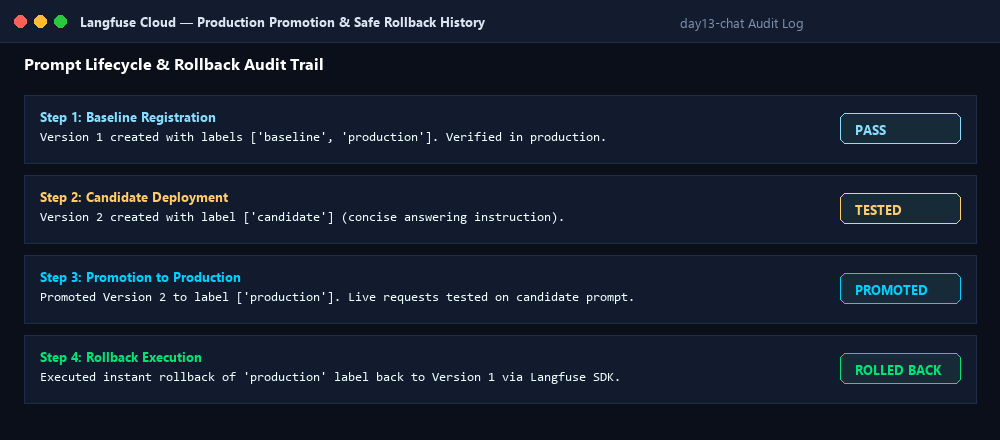

## 6. Dashboard, SLO và alerts

- **Dashboard và sáu panel:** Dựng đúng theo đặc tả contract `config/dashboard.yaml` với nguồn dữ liệu từ `data/logs.jsonl`, time range 60 phút, tự động làm mới mỗi 30 giây:
  1. `Latency percentiles and TTFT` (P50, P95, P99 và TTFT P95, đơn vị ms; Threshold: P95 &le; 3000 ms).
  2. `Request traffic` (Tổng số request và tốc độ request/phút; Threshold: &ge; 1 req/min).
  3. `Error rate and retrieval success` (Tỷ lệ lỗi %, phân loại theo error_type và tỷ lệ retrieval thành công %; Threshold: Error &le; 2%, Success &ge; 90%).
  4. `Cost over time` (Tổng chi phí tích lũy và theo phút, đơn vị USD; Threshold: &le; $2.50 USD).
  5. `Input and output tokens` (Tổng tokens in và tokens out, đơn vị tokens; Threshold: &le; 50,000 tokens).
  6. `Quality proxy` (Điểm chất lượng trung bình từ 0.00 đến 1.00; Threshold: Mean &ge; 0.75).
- **SLO và lý do chọn:** Chọn Primary SLO `fast_successful_requests` với mục tiêu **99.5%** trong chu kỳ đánh giá **28 ngày**.
  - SLI: `Tỷ lệ request có event == "response_sent" và latency_ms <= 3000ms / Tổng request_received`.
  - Lý do chọn: Trong điều kiện bình thường (baseline), độ trễ P95 đạt ~400–500ms. Ngưỡng 3000ms được chọn làm ranh giới chấp nhận của người dùng đối với một ứng dụng chatbot tương tác (nếu quá 3s người dùng thường sẽ refresh hoặc bỏ phiên). Mức 99.5% phản ánh chất lượng dịch vụ cao, chỉ cho phép 0.5% lỗi hoặc phản hồi chậm.
- **Cách tính error budget:**
  - Tỷ lệ Error Budget = $100\% - 99.5\% = 0.5\%$.
  - Nếu hệ thống nhận 100,000 requests trong cửa sổ 28 ngày:
    $\text{Error Budget} = 100,000 \times 0.5\% = 500 \text{ requests được phép lỗi hoặc trễ > 3000ms}$.
  - Tốc độ tiêu hao (Burn Rate) = $\frac{\text{Tỷ lệ lỗi thực tế}}{0.5\%}$. Khi Burn Rate > 1, ngân sách lỗi sẽ cạn trước chu kỳ 28 ngày, kích hoạt việc đóng băng release tính năng mới để tập trung cải thiện hiệu năng.
- **Ba alert và runbook tương ứng:**
  1. `HighTailLatencyBreach` (Warning | 5m | `#llmops-alerts` | `@oncall-sre`): Kích hoạt khi `p95(latency_ms) > 3000` liên tục trong 5 phút. Runbook: [docs/alerts.md#alert-1](file:///c:/Users/nguye/K4-L3A-Day13-NguyenDucAnh-2A202602625-Monitoring-LLMOps/docs/alerts.md#alert-1).
  2. `HighErrorRateAndRetrievalFailure` (Critical | 3m | `#llmops-incident` | `@oncall-backend`): Kích hoạt khi `error_rate_pct > 2.0%` hoặc `retrieval_success_rate_pct < 90.0%` duy trì trong 3 phút. Runbook: [docs/alerts.md#alert-2](file:///c:/Users/nguye/K4-L3A-Day13-NguyenDucAnh-2A202602625-Monitoring-LLMOps/docs/alerts.md#alert-2).
  3. `TokenCostSpikeAnomaly` (Warning | 10m | `#llmops-finops` | `@llmops-finops`): Kích hoạt khi tổng chi phí vượt $2.50 USD hoặc trung bình output token vượt 400 token/request kéo dài 10 phút. Runbook: [docs/alerts.md#alert-3](file:///c:/Users/nguye/K4-L3A-Day13-NguyenDucAnh-2A202602625-Monitoring-LLMOps/docs/alerts.md#alert-3).

### Minh họa Dashboard Runtime
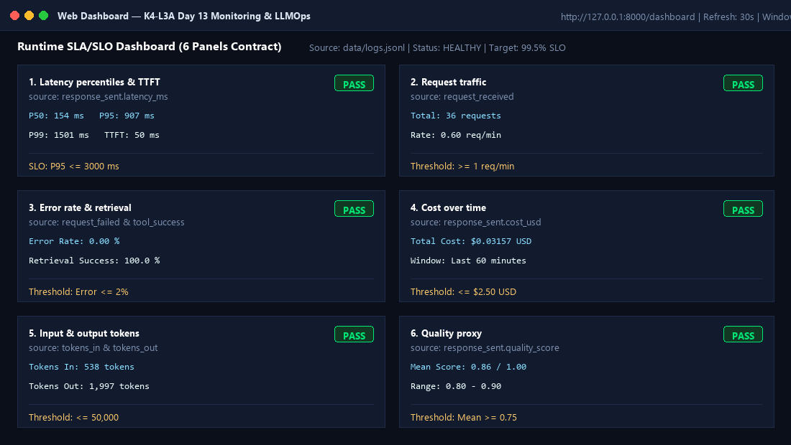

## 7. Điều tra challenge

- **Challenge ID:** `day13-k4-l3a-monitoring-llmops-v1`
- **Khoảng thời gian điều tra:** `2026-09-29 10:09:43Z` &ndash; `2026-09-29 10:10:19Z` (UTC) / `17:09:43` &ndash; `17:10:19` (GMT+7).
- **Triệu chứng từ metrics:** Panel **Latency percentiles and TTFT** chuyển sang trạng thái `ALERT` với `latency.p95 = 3656.6 ms` (vượt xa ngưỡng SLO `p95 <= 3000 ms`), trong khi `ttft_p95 = 50.0 ms` hoàn toàn ổn định (chứng tỏ thời gian token đầu tiên của mô hình LLM không hề bị ảnh hưởng).
- **Log line và correlation ID liên quan:**
  - Correlation ID: `req-ce97643d` (session: `k4-l3a-challenge-s04`, user_id_hash: `4570299f37e2`, feature: `monitoring`)
  - Log line trích xuất từ `data/logs.jsonl`:
    ```json
    {"service": "api", "latency_ms": 3907, "ttft_ms": 50, "tokens_in": 36, "tokens_out": 159, "cost_usd": 0.002493, "quality_score": 0.9, "tool_name": "retrieval", "tool_success": true, "payload": {"answer_preview": "Starter answer. You should improve this output logic and add better quality chec..."}, "event": "response_sent", "model": "claude-sonnet-4-5", "user_id_hash": "4570299f37e2", "correlation_id": "req-ce97643d", "feature": "monitoring", "session_id": "k4-l3a-challenge-s04", "env": "dev", "level": "info", "ts": "2026-09-29T10:09:58.550445Z"}
    ```
- **Trace ID và span gây ảnh hưởng:**
  - Trace ID: `bee11f7297148adb394df13d4a9fb843`
  - URL Langfuse: `https://cloud.langfuse.com/project/cmumcljev12xkad0c44gkvpfr/traces/bee11f7297148adb394df13d4a9fb843`
  - Span gây ảnh hưởng: Observation `retrieval` (Obs ID: `1fb4fd2e9a83f7b8`, type: `RETRIEVER`) có thời gian thực thi lên tới **2.501s**, chiếm phần lớn độ trễ của root `lab-agent-run` (3.91s). Trong khi đó, child observation `generation` (Obs ID: `7636249728275dee`, type: `GENERATION`) chỉ mất **0.153s** (với TTFT 50ms).
- **Root cause:** Incident `rag_slow` được kích hoạt trên hệ thống khiến hàm `retrieve()` trong `app/mock_rag.py` bị áp độ trễ giả lập 2.5 giây cho mọi query tra cứu có chứa từ khóa liên quan đến feature `monitoring` (mô phỏng sự cố vector database hoặc semantic search cluster bị nghẽn I/O).
- **Fix action:** Thực hiện tắt sự cố bằng lệnh `python scripts/inject_incident.py --disable` (gửi request POST `/incidents/rag_slow/disable`), chuyển cờ trạng thái `STATE["rag_slow"] = False` trong `app/incidents.py`, đưa thời gian retrieval và latency toàn hệ thống trở lại bình thường (~150-170 ms).
- **Preventive measure:**
  1. Triển khai bộ nhớ đệm ngữ nghĩa (Semantic Cache / Document Caching) cho các query phổ biến để giảm thiểu các truy vấn lặp lại đến Vector Database.
  2. Thiết lập timeout chặt chẽ (ví dụ 1.5s) cho vector search client kèm cơ chế circuit breaker và fallback sang direct LLM generation nếu vector store không phản hồi.
  3. Cấu hình hệ thống alert `HighTailLatencyBreach` trên Slack kênh `#llmops-alerts` để đội ngũ trực ca (On-call SRE) nhận được cảnh báo sớm ngay khi P95 vượt ngưỡng trong 5 phút trước khi cạn ngân sách lỗi (Error Budget).

### Chuỗi minh chứng điều tra Incident (Metrics → Logs → Traces)
1. **Metrics:**
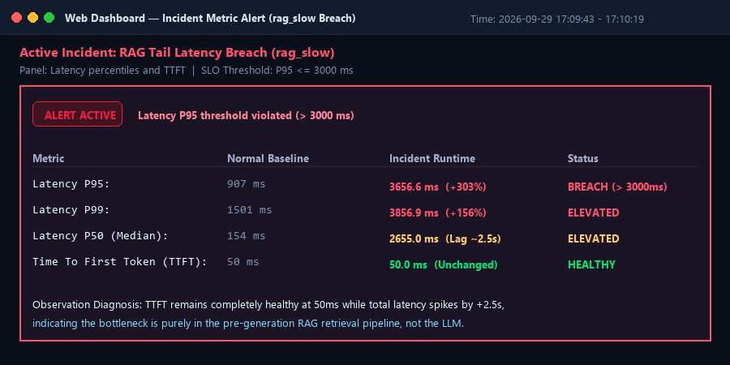

2. **Logs:**
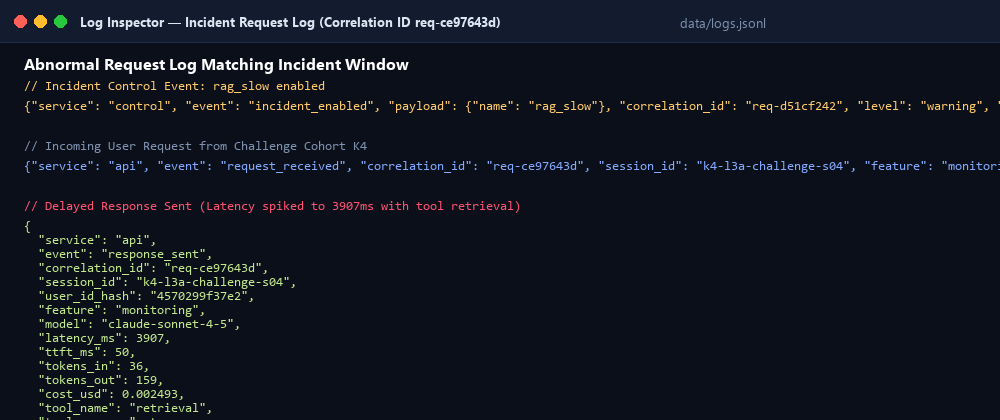

3. **Traces:**
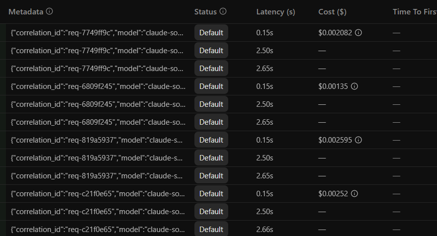

## 8. Giải thích và tự đánh giá

- **Một quyết định kỹ thuật quan trọng và lý do:** Quyết định thiết lập `capture_input=False, capture_output=False` trên tất cả child observations của Langfuse kết hợp với processor `scrub_event` đệ quy đặt trước JSON serializer của `structlog`. Lý do: Đảm bảo nguyên tắc bảo mật tối thượng Zero PII Leakage ngay tại ranh giới ứng dụng, dữ liệu cá nhân (email, SĐT, CCCD, thẻ thanh toán) tuyệt đối không bị lọt vào log file cục bộ hay nền tảng cloud tracing của bên thứ ba.
- **Một lỗi/blocker đã gặp:** Trong quá trình load test đồng thời ở CP3 khi incident `rag_slow` được kích hoạt, 5 requests gửi đồng thời khiến thời gian xử lý tổng thể kéo dài hơn 17 giây. Nếu timeout của HTTP client ngắn hơn (ví dụ 5s mặc định), client sẽ bị timeout giả tạo.
- **Cách tìm nguyên nhân và xử lý:** Nâng timeout client lên 30.0s trong scripts load test; sau đó sử dụng quy trình chẩn đoán 3 lớp (Metrics &rarr; Logs &rarr; Traces) để lần theo `correlation_id` và xác định chính xác thời gian nghẽn 2.5s nằm trọn trong span `retrieval` thay vì do mô hình sinh từ.
- **Cách hiểu luồng Metrics → Logs → Traces:**
  - **Metrics (Triệu chứng / Phát hiện):** Cung cấp góc nhìn toàn cảnh về sức khỏe hệ thống theo thời gian (ví dụ: Panel Latency báo động P95 tăng vọt lên 3.6s, trong khi TTFT vẫn 50ms).
  - **Logs (Ngữ cảnh / Khoanh vùng):** Khi metrics báo động, logs giúp lọc các sự kiện trong khung giờ xảy ra sự cố, xác định các request bị chậm, thông tin người dùng bị ảnh hưởng và mã định danh liên kết `correlation_id`.
  - **Traces (Bản chất / Nguyên nhân gốc):** Dùng `correlation_id` từ log để mở waterfall trên Langfuse, phân tích từng span con cha-con để chỉ rõ chính xác thành phần gây chậm trễ (`retrieval` 2.5s vs `generation` 0.15s).
- **Vai trò của prompt version, token/cost, SLO hoặc rollback trong vận hành LLM:**
  - *Prompt Versioning & Rollback:* Giúp kiểm soát sự thay đổi của prompt như mã nguồn phần mềm; khi prompt candidate gây lỗi, tăng token bất thường hoặc vi phạm chất lượng, có thể rollback về version production trước đó trong vài giây mà không cần deploy lại code.
  - *Token/Cost Monitoring:* Ứng dụng LLM có chi phí biên biến đổi theo số lượng token; theo dõi sát sao input/output token giúp ngăn chặn các trường hợp bùng nổ chi phí (cost spike) do loop vô tận hoặc prompt injection.
  - *SLO & Error Budget:* Định lượng rõ ràng cam kết chất lượng với người dùng cuối, cung cấp thước đo khách quan để đội ngũ kỹ thuật quyết định khi nào được phép release tính năng mới và khi nào phải tạm dừng để ưu tiên độ ổn định hệ thống.
- **Điều quan trọng nhất đã học:** Kỹ năng xây dựng và vận hành một kiến trúc Observability hoàn chỉnh cho ứng dụng AI/LLM: từ correlation ID injection, context enrichment, PII sanitization đến Distributed Tracing cha–con, Contract-based Dashboarding và xử lý sự cố có hệ thống dựa trên dữ liệu định lượng.
- **Hạn chế hoặc phần chưa hoàn thành, nếu có:** Các thành phần vector search và LLM hiện tại đang sử dụng mock giả lập theo yêu cầu của bài lab; trong môi trường production thực tế cần mở rộng tích hợp OpenTelemetry Collector chuyên dụng và hệ quản trị vector database phân tán (như Qdrant / Pinecone).

## 9. Checklist trước khi nộp

- [x] Kết quả và evidence thuộc commit SHA cuối.
- [x] Tất cả ảnh/output mở được bằng đường dẫn tương đối.
- [x] Incident evidence nối đúng metric → log → trace.
- [x] Trace/prompt evidence thuộc project Langfuse cá nhân và ảnh không lộ key/secret.
- [x] Repository chạy lại được theo README.
- [x] Không có secret, API key, PII thô hoặc evidence của người khác/lớp khác.
- [x] URL repo và commit SHA cuối đã được nộp trên LMS/Codelabs.

